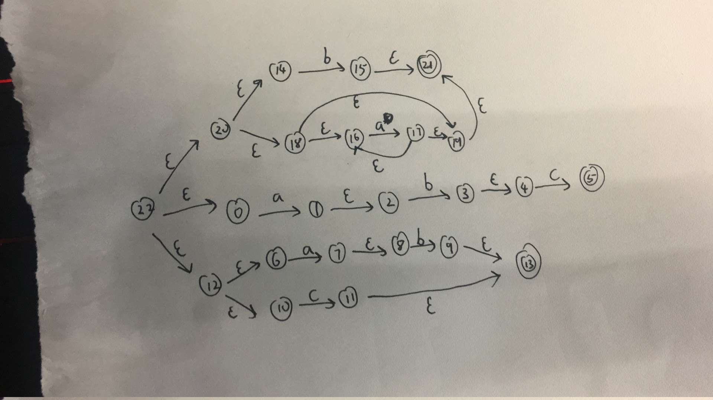
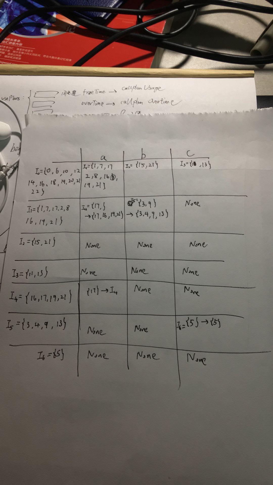

# 简化版LEX报告

## 目录
   
* [项目描述](#1)
* [模块设计及中间结果校验](#2)
* [使用说明](#3) (如果想测试运行请看这一部分)
* [个人感受](#4)

<br>
<br>

## 1. 项目描述

&emsp;&emsp; Lex是一个根据输入的词法规则描述文件来产生对应词法分析程序的程序. 一般lex程序会根据输入的.l文件来产生对应的c词法分析程序.    

&emsp;&emsp; 当下比较流行的开源程序为flex(fast lexical analyzer), 下面给出一个flex程序输入文件的示例([维基百科](https://zh.wikipedia.org/wiki/Lex)):

``` cpp
这只程序分辨出哪里是表示数字（整数）的字符串，并且把他们印出来。

/*** 定義區塊***/

%{
/* 會直接照搬放檔頭的C code */
#include <stdio.h>
%}

/* 這裡告訴flex只要讀取輸入的檔案（不需要其他檔案）*/
%option noyywrap

%%
    /*** 規則區塊***/

    /* [0-9]+代表包含一個或多個數字的字串*/
[0-9]+  {
            /* yytext是一個字串變數，內容是符合規則的字串本身。*/
            printf("Saw an integer: %s\n", yytext);
        }

.       {   /* 忽略所有其他的字*/   }

%%
/*** C程式碼區塊***/

int main(void)
{
    /* 呼叫lexer，然後結束程式*/
    yylex();
    return 0;
}
``` 

将这个文件输入给flex，它会将这个文件转换成一个C文件，档名lex.yy.c。这个C文件可以被编译成一份可执行档，功能为找出并且输出代表整数的字符串。例如，给定输入： 
```
abc123z.!&*2ghj6
```
文件则会输出匹配到的token:
```
Saw an integer: 123
Saw an integer: 2
Saw an integer: 6
```

因个人能力有限,只实现了一个非常简单的lex版本:  
>> 1. lex程序整体采取python语言书写  
>> 2. 输入文件中只能包含正规表达式部分,且正规表达式部分只支持 `*` `|` `.` `()`运算符,且每个独立正规表达式不能包含上文已经声明的正规表达式,否则默认按照真实字符串处理.
>> 3. 输入文件不支持注释, 支持空行
>> 4. 若发现冲突正规表达式, 默认按照输入文件中的输入顺序匹配token.
>> 4. 不能转义运算符
>> 4. 有异常处理机制

例如:  
输入正规表达式规则如下, 第一个字符串表示token, 第二个表示对应正规表达式.
```
if if
ex1 a*ab|c
ex2 asd
```
输出lex.py程序, 运行lex.py程序对如下输入处理
```
python lex.py input2.txt output2.txt
```
```
if aaaab asd
```
输出: 
```
if  ex1  ex2  
```

<br>
<br>

## 2. 模块设计和中间结果校验

### 2.1 输入模块(LexInput.py)

流程: 
> 1. 读入输入文件的每一行
>> 1. 如果是空行跳过
>> 2. 如果是正常输入, 则提取token和reg expression
> 2. 构建token和reg的dict返回  

注意:
> 最简单模块,没有什么值得注意的

例子:  
```
t1 abc
t2 ab|c
t3 b|a*
```
>输出:  
```
{'t1': 'abc', 't2': 'ab|c', 't3': 'b|a*'}
```


### 2.2 预处理(LexPreprocess.py)
流程:  

> 1. 对每个reg添加 ```.``` 运算符(add_points函数)
>> 1. 两个非运算符字符间添加
>> 2. 非运算符字符和 ```(``` 间添加
>> 3. ```)``` 和非运算符之间添加
>> 4. ```*``` 和非运算符之间添加
>> 5. ```*``` 和 ```(``` 之间添加
> 2. 中缀表达式转后缀表达式. 按照传统方法借助栈数据结构进行.
>> 1. 注意: ```*``` 为单目运算符且已经在对应符号后面,所以要当成非运算符处理,而不能当成 乘号 进行处理.否则会出现问题.

例子:  
(1) 输入: 2.1 中输出

输出: 
``` python
{'t1': 'ab.c.', 't2': 'ab.c|', 't3': 'ba*|'}
```

(2) 输入: 
``` python
{'t': '(ac|b*)*b|c'}
```

输出:  
``` python
{'t': 'ac.b*|*b.c|'}
```
<br>

### 2.3 regular expression -> NFA(LexFA.py)

流程:  

> 1. 按照常规的后缀表达式求值方法,对于每个token对应RE构建自动机(single_reg_to_nfa函数)
>> 1. '```.```' 运算符
``` python
def concatenate_two_automatons(a1, a2):
    """
    '.'号运算,连接两个自动机
    a.b:  s1--a-->s2--epsilon-->s3---b--->s4
    :param a1: 在前的自动机
    :param a2: 在后的自动机器
    :return:
    """
```
>> 2. '```|```' 运算符
``` python
def or_two_automatons(a1, a2):
    """
    '|'运算两个自动机a, b
    a|b:
         / --s4------a----->s6-----\
         epsilon                    epsilon
       /                             ↘
    s1                                s2
       \                             ↗
        epsilon                     epsilon
         \----s3------>b-----s5----/
    :param a1: 第一个自动机
    :param a2: 第二个自动机
    :return:
    """
```
>> 3. '```*```' 运算符
``` python
def closure_one_automaton(a):
    """
    '*'操作, 构建自动机a的闭包
    例如:
                          /-epsilon-e3-\
                         ↙             \
        s1-e1-epsilon--->s3------a------>s4--epsilon---e4-> s2
         \                                                 ↗ 
          \-------e2---------epsilon---------------------/
    :param a:
    :return: 构建好的闭包
    """
```

> 2. 构建新的初始状态连接到每个已经构建好的自动机初始状态.

例子:  

输入: 2.1中例子(1)的输出
``` python
{'t1': 'ab.c.', 't2': 'ab.c|', 't3': 'ba*|'}
```

输出:   
第一个数字代表状态编号, 字典key值代表边, 字典val代表边指向的状态
``` python
22 {'epsilon': [0, 12, 20]}
0 {'a': [1]}
1 {'epsilon': [2]}
2 {'b': [3]}
3 {'epsilon': [4]}
4 {'c': [5]}
5 {}
12 {'epsilon': [6, 10]}
13 {}
6 {'a': [7]}
7 {'epsilon': [8]}
8 {'b': [9]}
9 {'epsilon': [13]}
10 {'c': [11]}
11 {'epsilon': [13]}
20 {'epsilon': [14, 18]}
21 {}
14 {'b': [15]}
15 {'epsilon': [21]}
16 {'a': [17]}
17 {'epsilon': [19, 16]}
18 {'epsilon': [19, 16]}
19 {'epsilon': [21]}
start_state:  22
```   
与手推答案作比较:  


可以发现是相同的  

### 2.4 NFA -> DFA(LexFA.py)

过程:  
>1. 构建DFA状态转移表 (nfa_to_dfa_table函数)
>> 1. 构建起始状态epsilon闭包(以下简称ec), 记为I<sub>0</sub>
>> 2. 由I<sub>0</sub>开始根据除epsilon边以外的所有边推出到新的状态,按照顺序记为 I<sub>1</sub>  I<sub>2</sub> ......
>> 3. 由新的状态继续重复2过程, 直至不再有新的状态产生  
    
>> 例子:  
输入: 2.3例子输出   
输出:  
``` python
                                                           a                   b                c
{0, 6, 10, 12, 14, 16, 18, 19, 20, 21, 22}:  {1, 2, 7, 8, 16, 17, 19, 21}   {21, 15}         {11, 13}
{1, 2, 7, 8, 16, 17, 19, 21}:                {16, 17, 19, 21}               {9, 3, 4, 13}    None
{21, 15}:                                    None                            None            None
{11, 13}:                                    None                            None            None
{16, 17, 19, 21}:                            {16, 17, 19, 21}                None            None
{9, 3, 4, 13}:                               None                            None            {5}
{5}:                                         None                            None            None
```
>> 与手推版作比较:  


>> 简化版:   
``` python
    a     b     c
0:  1     2     3
1:  4     5     None
2:  None  None  None
3:  None  None  None
4:  4     None  None
5:  None  None  6
6:  None  None  None
```

>2. 由dfa状态转移表构建dfa (convert_table_to_dfa函数)  
>> 例子:  
>> 输入: 上一步输出
>> 输出:  
其中第三列代表: 若为结束状态对应的token值
``` python
0 {'a': 1, 'b': 2, 'c': 3} ['t3']
1 {'a': 4, 'b': 5} ['t3']
2 {} ['t3']
3 {} ['t2']
4 {'a': 4} ['t3']
5 {'c': 6} ['t2']
6 {} ['t1']
start_state:  0
```

注意: 
> 1. 求ec时,要注意是否有epsilon环结构,防止产生死循环

### 2.4 DFA -> DFA<sup>。</sup>(dfa_minimize函数)

过程:  
> 1. 按照是否为结束状态划分两个等价类
> 2. 按照是否为相同的弱等价关系(是否推出同一等价类), 对每一个分类进行进一步划分
> 3. 重复2 过程, 直至不再产生新的划分  

注意: 
> 1. 上述3 中步骤要注意每轮迭代后, 前一轮已经划分结果可能会因后面结果的改变而产生新的划分

例子:  
输入:  2.3 中输出  
输出:  
``` python
0 {'a': 1, 'b': 2, 'c': 3} ['t3']
1 {'a': 4, 'b': 5} ['t3']
2 {} ['t3']
3 {} ['t2']
4 {'a': 4} ['t3']
5 {'c': 6} ['t2']
6 {} ['t1']
start_state:  0
```
> 这里有一点值得注意的地方, 对于2, 3, 6状态, 通过所有边推出的都是None, 一开始时, 按照我的程序规则将其划分为同一等价类, 也就是
```python
0 {'a': 1, 'b': 2, 'c': 2} ['t3']
1 {'a': 3, 'b': 4} ['t3']
2 {} ['t3', 't1', 't2']
3 {'a': 3} ['t3']
4 {'c': 2} ['t2']
```
> 然而发现这样会导致多个token的终止状态重合,也就是上述2 状态, 含有多种情况终止状态(并非由正规表达式设计导致), 所以终止状态不同的状态不能划分为同一个等价类  

### 2.5 输出程序(LexOutput.py)
过程: 
> 1. 将构建好的最简化自动机传入, 生成状态转移表对应的代码  
> 2. 将状态转移表部分代码与固定的前置代码和后置代码拼接, 生成最终输出文件

例子:  
使用生成 lex.py进行词法分析:   
(1) 正常情况   
输入:  
```
abc aaaaaaa ab c
```
输出:  
```
t1  t3  t2  t2  
```
(2) 异常情况(无法匹配)  
输入:  
```
abc aaaaaxxaa ab c
```
输出:  
```
在第2个单词6个字符处, 正规表达式无法匹配
```

(3) 非终止状态结束  
因为上述自动机中所有状态都是终止状态, 所以将正规表达式规则修改为: 
```
t1 abcd
t2 ab|c
t3 b|a*
```

输入:  
```
abcd aaaaaaa abc c
```

输出:  
```
在第 3 个单词处, 单词未结束或书写错误, 正规表达式无法匹配
```


## 3. 使用说明  
使用如下命令指定输入,输出文件
```
python Main.py inputPath output.py
```
然后
```
python output.py inputPath outputPath
```
在outputPath指定文件中查看输出token

例如:
可使用项目中提供的内容进行测试
测试一:  

```
python Main.py ./test/input1.l ./test/lex1.py

# 正常情况
python ./test/lex1.py ./test/testInput1.txt ./test/testOutput1.txt

# 异常处理一
python ./test/lex1.py ./test/testInput1_with_error.txt ./test/testOutput1.txt

# 异常处理二
python ./test/lex1.py ./test/testInput1_with_error_1.txt ./test/testOutput1.txt
```

测试2:  
```
python Main.py ./test/input2.l ./test/lex2.py

python ./test/lex2.py ./test/testInput2.txt ./test/testOutput2.txt
```

测试3:  
```
python Main.py ./test/input3.l ./test/lex3.py

python ./test/lex3.py ./test/testInput3.txt ./test/testOutput3.txt
```

如果要自己书写正规表达式.l文件中token和regular expression之间有且只能有一个空格.
因为写的比较简陋,很多功能无法使用,且输入处理也不够友好,望多多包容

<br>
<br>

# 4 感受

加深了对词法分析流程和算法具体实现的理解.   

本来觉得边写边测试, 程序bug会相对少一些, 结果在写文档过程中又发现了3处bug, 认识到充分测试的重要性. 平常测得太简单,不知道什么时候就被一些特殊情况bug.   

时间有限,能力更有限,到ddl前四天开始写, 很多功能都没有实现, 即使只有最简单的部分, 依然写到了ddl前五个小时